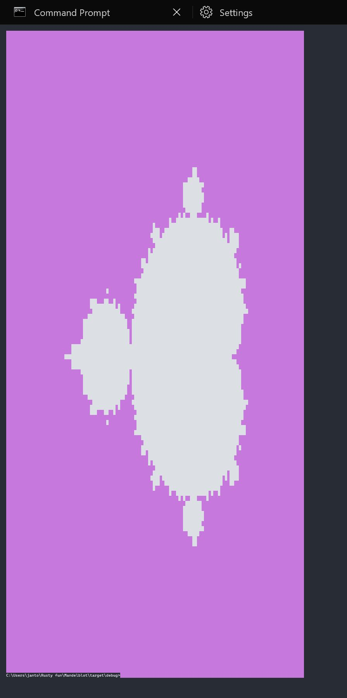

# Mandelblot

That's a little project for fun. The main goals are:

- me learning coding in Rust
- learning to code some more complicated graphical stuff in the terminal
- also making a little tool for visualizing the Mandelbrot set

